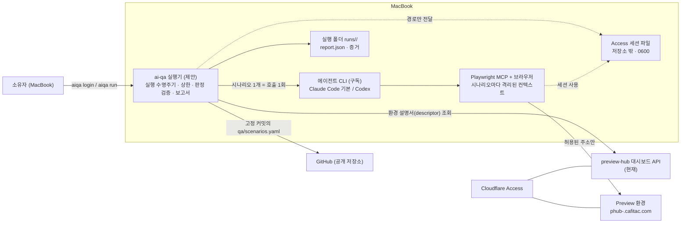

# Context map

- Authority: preview-hub owns environments and the descriptor; service repositories own scenarios; ai-qa owns the run (what was executed, verdict acceptance, report). The agent CLI is a tool with no authority: its answer is input that the runner validates.
- ai-qa is downstream of preview-hub and never mutates environments.
- Genuine external boundaries: `DescriptorSource` (hub API or file), `ScenarioSource` (GitHub raw or file), `AgentRunner` (Claude Code / Codex subprocess), `BrowserSession` (Playwright for login and preflight). Nothing else is abstracted.
- Q3 adds a trigger (PR comment via preview-hub's bot) and a VM container; the run core is unchanged.
