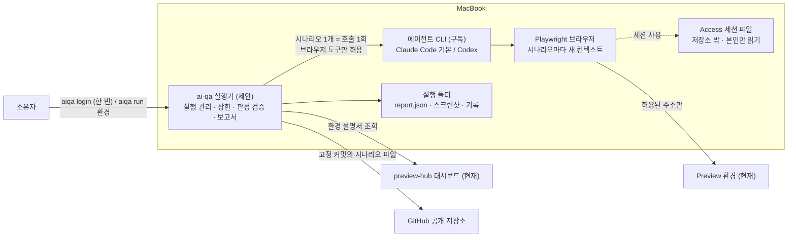
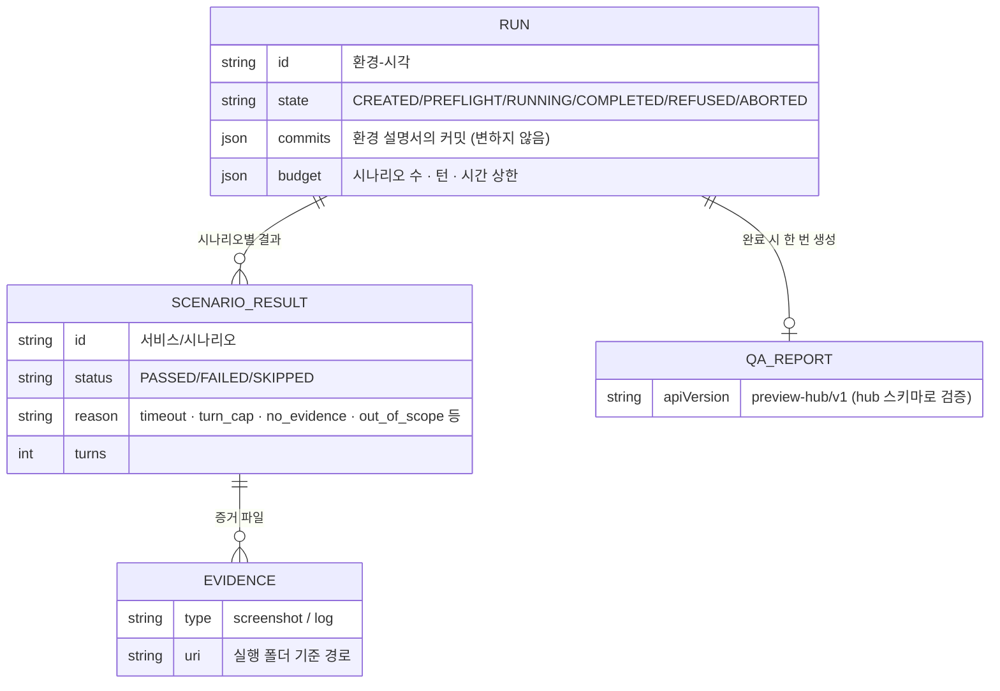
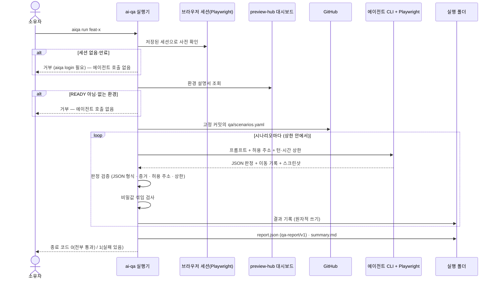
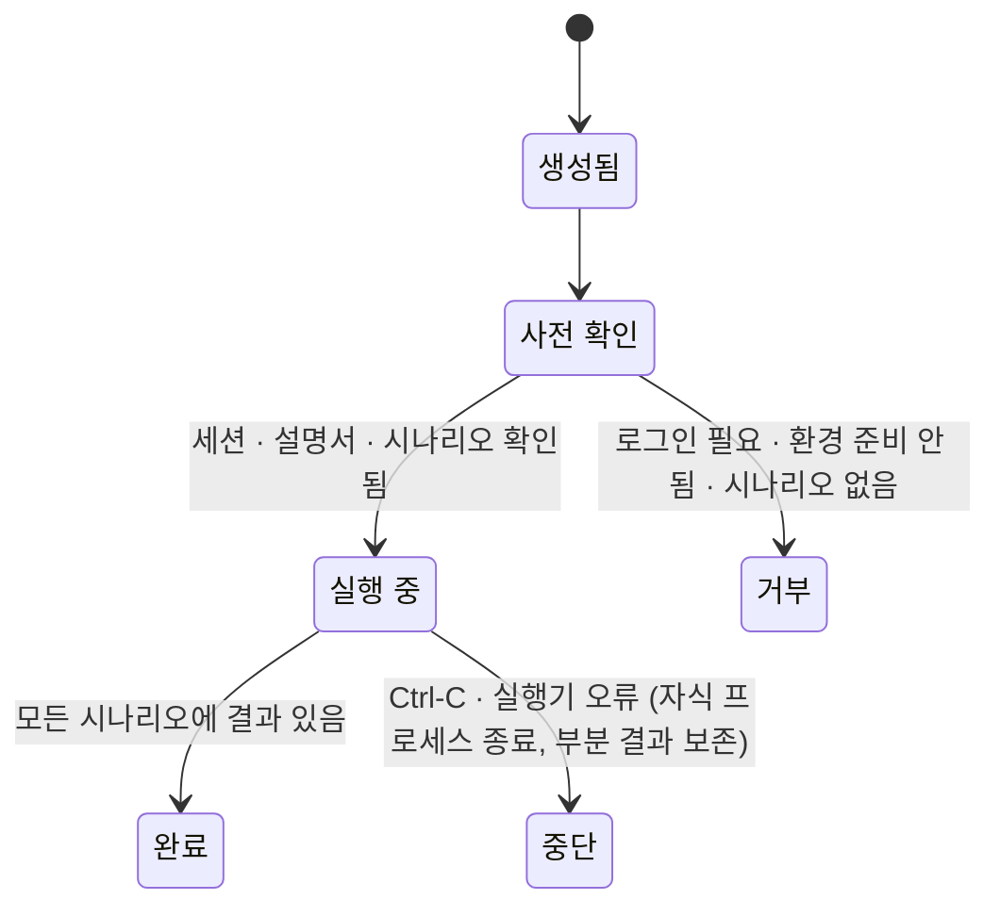

# 설계 검토

- 기능 / 범위: ai-qa v1 — Preview 환경에서 AI가 브라우저로 자연어 시나리오를 실행하고 보고서를 남긴다 (Q1: MacBook 실행기)
- 근거 상태: 현재(CURRENT) / 제안(PROPOSED) / 미결정(OPEN)
- 기준 산출물: `01-context-map.md`, `02-domain-model.puml`, `04-target-schema.dbml`, `05-transaction-flows.puml`, `06-state-machines.puml`, `07-consistency-migration.md`, `08-acceptance-trace.md`, `11-interface-contracts.md`
- 검토 언어: 한국어
- 표현 원칙: TARGET_OVERVIEW_FIRST

## 한눈에 보는 최종 구조

- 현재: ai-qa 코드는 없다. preview-hub가 환경 설명서(descriptor)와 보고서 형식(qa-report/v1)을 이미 제공하고, 환경은 Cloudflare Access 뒤의 `phub-<환경>.cafitac.com` 한 주소로 열린다.
- 완성 후: MacBook에서 `aiqa run <환경>` 한 번으로, 서비스 저장소의 `qa/scenarios.yaml`(자연어)을 고정된 커밋에서 읽어 시나리오마다 에이전트 CLI를 한 번씩 호출한다. 에이전트는 Playwright로 실제 브라우저를 조작하고 JSON 판정을 돌려준다. 실행기는 그 판정을 그대로 믿지 않고 증거·이동 기록·상한을 확인한 뒤 `qa-report/v1` 보고서와 스크린샷을 실행 폴더에 남긴다.
- 안전 경계: 에이전트에는 브라우저 조작 도구만 준다(셸·파일·스크립트 실행 없음). 접속 세션은 소유자가 직접 로그인해 만든 파일이며 에이전트에게 글자로 보이지 않는다. 이동은 환경 주소와 Access 주소로 제한하고, 벗어나면 그 시나리오를 실패 처리한다. 보고서·로그에 쿠키나 토큰이 섞이면 지우고 실패 처리한다. 유료 API는 쓰지 않고 호출 수·턴 수·시간으로 상한을 둔다.

## 시각화

### 전체 목표 구조

근거: `01-context-map.md`, `07-consistency-migration.md`

- ai-qa는 환경을 만들거나 바꾸지 않는다. 읽기만 한다.
- 에이전트의 답은 "입력"일 뿐이고, 통과 판정은 실행기가 확인한 뒤에만 인정된다.

### 목표 데이터 구조

근거: `04-target-schema.dbml`, `11-interface-contracts.md` K5 (데이터베이스 없음 — 실행 폴더의 파일 구조)

### 핵심 트랜잭션 흐름

근거: `05-transaction-flows.puml`

### 도메인 상태와 권한

근거: `06-state-machines.puml`, `07-consistency-migration.md`

## 전달 계획 참고 (보조 정보)

| 순서 | PR 단위 | 담당 설계 범위 | 검증 / 관찰 | 롤백 경계 |
|---|---|---|---|---|
| 1 | QU1 (ai-qa) | 저장소 뼈대, 계약·스키마, 실행 수명주기와 보고서 (가짜 에이전트) | 단위 테스트 B1·B3·B5 | 저장소 되돌리기 |
| 2 | QU2 (ai-qa) | Claude/Codex 실행기, 로그인·사전 확인, 판정 검증, 비밀값 검사 | 단위 테스트 B4·B5, 로컬 스모크 | 되돌리기 |
| 3 | QU3 (예제 저장소) | 예제 프론트의 시나리오 파일, 일부러 고장 낸 브랜치 | CI | 파일 삭제 |
| 4 | QU4 (ai-qa) | 실제 환경 실행(B1·B2·B4), README | 실제 실행 로그 | 실행 폴더 삭제 |

## 확인이 필요한 결정

- 이 설계(기본 에이전트 Claude Code, 시나리오 1개당 호출 1회, 판정 검증, 세션 파일 방식, 데이터베이스 없음)로 승인 / 수정 / 중단.
- Q3(VM 자동 실행)에 필요한 서비스 토큰과 hub 변경은 이번 설계에서 다루지 않고 미결정(KO1)으로 남긴다.
